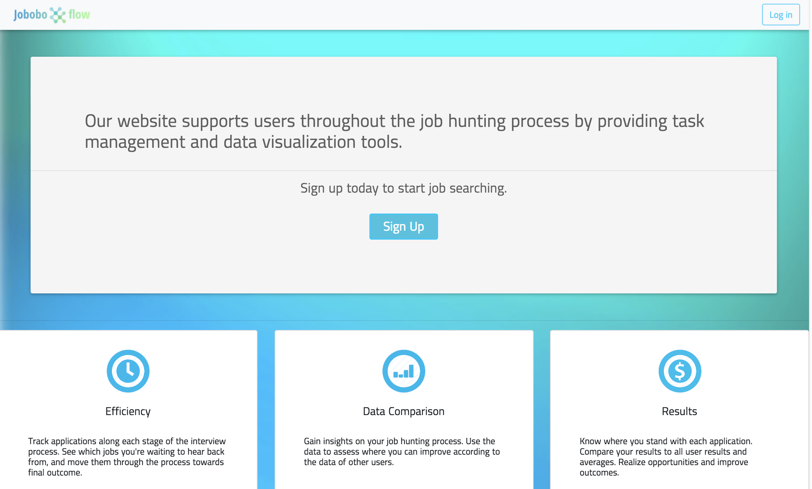
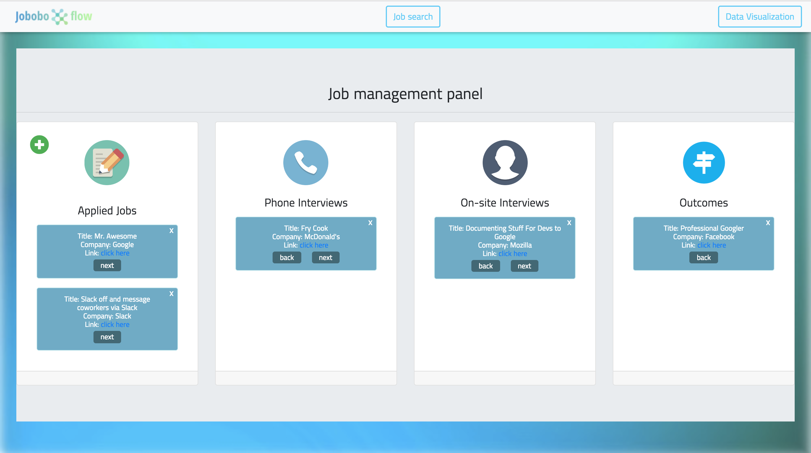
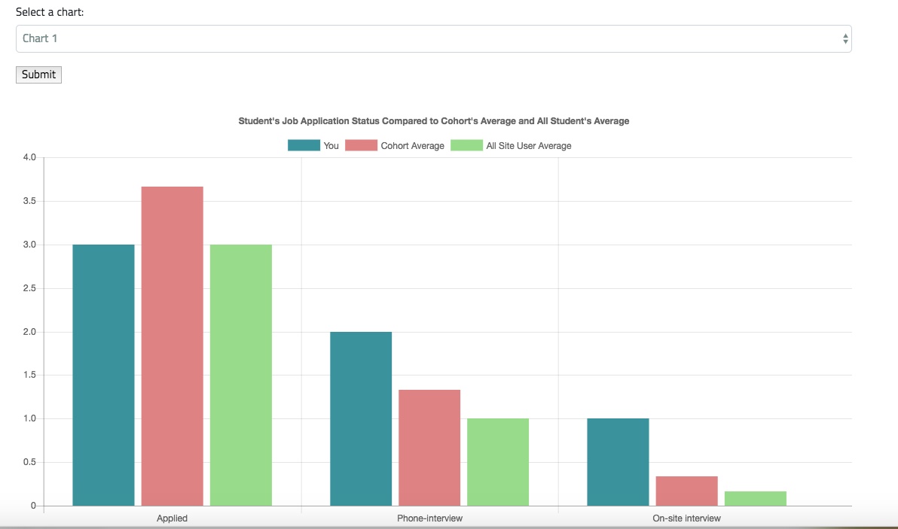
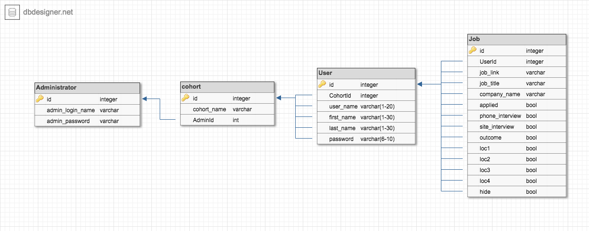
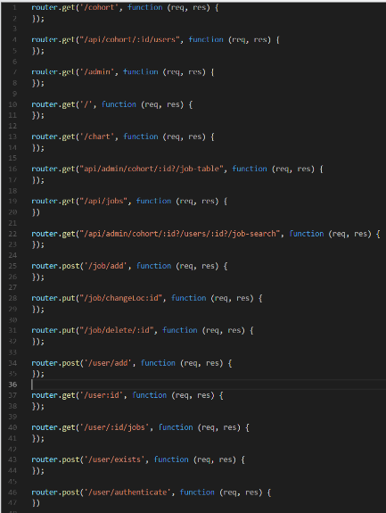

# JoboboFlow
JoboboFlow aids users in their job hunting process by providing tracking & data visualization tools. 

## Features
Some of the features that make JoboboFlow really awesome include:

* Task tracking

* Data visualization

## Why use JoboboFlow?
It's cumbersome to create and manage your job-hunt tracking system. Joboboflow fills that role of consolidating information that's most useful to users.

## How?
JoboboFlow collects data on the jobs its users apply to and saves the data into a MySQL database. This data is then queried to render job info to users.

## Technical Aspects

### Built With
* [Javascript](https://eloquentjavascript.net/)
* [Node](https://nodejs.org/en/)
* [MySQL](https://www.mysql.com/)

#### Node modules Used
* [Sequelize](http://docs.sequelizejs.com/)
* [Express](https://expressjs.com/)
* [mysql2](https://github.com/sidorares/node-mysql2)
* [express-handlebars](https://github.com/ericf/express-handlebars)

#### Middleware
* [body-parser](https://github.com/expressjs/body-parser)

### Relations
Here's our models

### Routes
Here's our routes -minus the body content.

## Stretch Goals
* Add a trash can that collects denied applications.
* Finish adding a login functionality for an Admin.
* Render jobs to users from the Indeed API.
* Implement Google OAuth with passport
* Add line graph data visualizations

## Authors

* **Kitty Shen**
* **Unobtainiumrock**
* **Hannah Lim**
* **Alexandra Goodwin**

## License

This project is licensed under the MIT License - see the [LICENSE.md](LICENSE.md) file for details

## Acknowledgments

* Cats Meowing kittykuma.com
* Unobtainiumrock Industries ®

